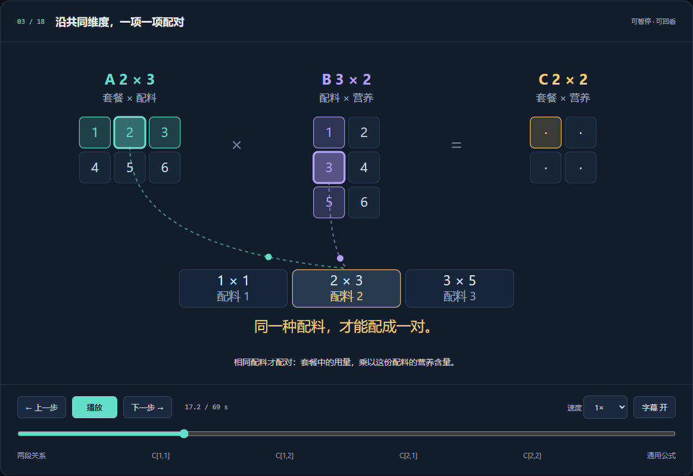
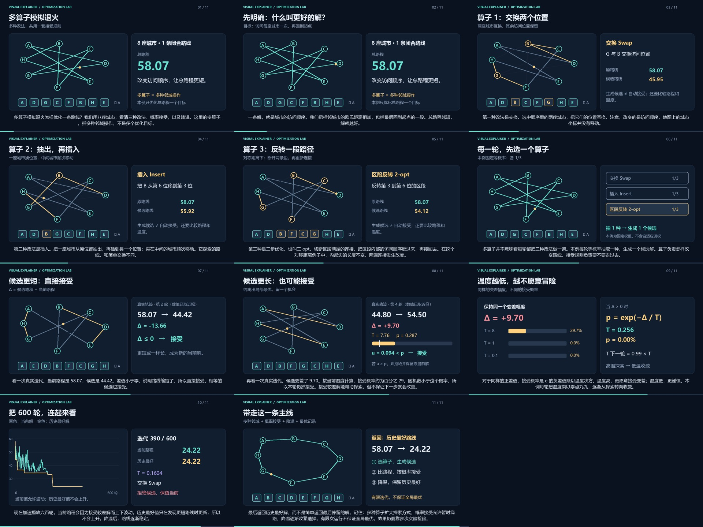
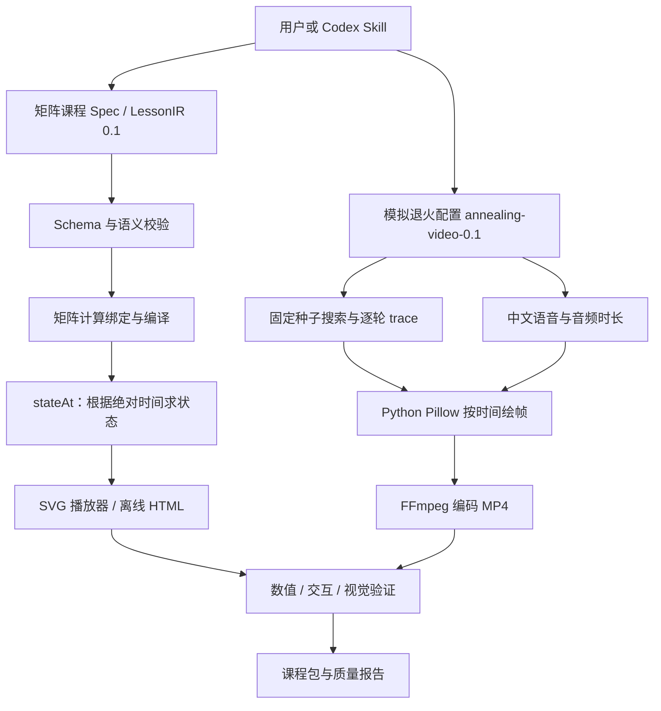

# Visual Explainer

**把抽象知识变成可观看、可暂停、可验证的动画。**

Visual Explainer 是一个正在演进的知识可视化项目，包含静态课程网站、确定性矩阵乘法播放器、带中文配音的多算子模拟退火视频，以及配套的 Codex Skill。项目优先让计算结果可以复现、动画状态可以回放、课程质量可以检查，再逐步扩展生成能力。

> 当前是两个已经实现的教学示例，不是覆盖所有学科的一键 AI 视频平台。网站可以直接播放现有课程；生成新课程需要在本地运行脚本或调用 Skill。

[快速开始](#快速开始) · [安装与使用-skill](#安装与使用-skill) · [技术架构](#技术架构) · [制作矩阵课程](#制作矩阵课程) · [制作模拟退火视频](#制作模拟退火视频) · [测试与质量验证](#测试与质量验证) · [常见问题](#常见问题)

## 已实现的课程

| 课程 | 核心问题 | 交付形式 | 主要能力 |
| --- | --- | --- | --- |
| 矩阵乘法 | 为什么不是对应元素相乘？ | 69 秒默认时间轴、交互网页、离线 HTML | 行列配对、逐项累加、结果写入、修改输入、语义单步 |
| 多算子模拟退火 | 多种邻域操作如何与接受概率和降温协同？ | 约 3 分 06 秒 MP4、中文合成语音、字幕、章节播放器 | 交换、插入、2-opt、接受较差解、600 轮轨迹、历史最优记录 |

### 矩阵乘法



- 播放、暂停、倍速、进度拖动、前后语义步骤、字幕开关。
- 修改输入矩阵后重新计算乘积、部分和与最终输出。
- 点击矩阵格，记录当前对象、场景、时间及选中单元格。
- 提供预置的路径解释，用另一种表述说明为什么要累加。
- [离线 HTML 文件](lessons/matrix-multiplication/preview/standalone.html) · [课程 IR](lessons/matrix-multiplication/lesson.ir.json) · [质量报告](lessons/matrix-multiplication/quality-report.json)

### 多算子模拟退火



以八座城市的对称欧氏旅行商问题为例，每轮从交换、插入和 2-opt 中等概率选择一个算子，生成候选路线，再按模拟退火规则决定是否接受。

- 城市位置固定，动画改变访问顺序和路径连接。
- 演示真实轨迹中“更好的候选直接接受”和“更差的候选概率接受”。
- 对比温度对接受概率的影响，展示当前解与历史最好解的区别。
- 固定随机种子；候选、差值、接受概率、随机数与决策均保存并检查。
- [下载 MP4](lessons/multi-operator-annealing/exports/multi-operator-annealing.mp4) · [中文字幕](lessons/multi-operator-annealing/exports/chinese.srt) · [计算轨迹](lessons/multi-operator-annealing/data/trace.json) · [质量报告](lessons/multi-operator-annealing/quality-report.json)

GitHub 文件页面不会把 HTML 当网站运行。请下载后打开，或按下面的方式启动本地网站。

## 快速开始

### 方式一：只体验现有课程

安装 Git 和 Node.js 22 或更高版本，执行：

```sh
git clone https://github.com/xingchenyd/visual-explainer.git
cd visual-explainer
node scripts/serve.mjs . 4317
```

浏览器访问 **http://127.0.0.1:4317/**，首页包含两个课程入口。

这个启动过程使用 Node.js 内置模块，不需要先安装 npm 依赖，也不需要 API 密钥。服务器仅监听本机 `127.0.0.1`，按 `Ctrl+C` 结束。

也可以直接打开以下文件：

```text
lessons/matrix-multiplication/preview/standalone.html
lessons/multi-operator-annealing/exports/index.html
```

矩阵课程的 `standalone.html` 已内嵌代码、样式和课程数据，可以单文件离线打开。视频网页需要与同目录下的 MP4、poster.png 一起保留；MP4 本身可以直接在视频播放器中播放。

### 方式二：开发与验证

```sh
npm ci
npm test
npm run validate
npm run build
npm run dev
```

`npm run dev` 默认只服务矩阵课程的 preview 目录，访问地址是 **http://127.0.0.1:4317/apps/player/**。

两个启动命令的根目录不同：

| 命令 | 提供内容 | 打开地址 |
| --- | --- | --- |
| `node scripts/serve.mjs . 4317` | 完整网站首页与课程目录 | `http://127.0.0.1:4317/` |
| `npm run dev` | 矩阵课程 preview | `http://127.0.0.1:4317/apps/player/` |
| `node scripts/serve.mjs lessons/multi-operator-annealing 4318` | 视频课程目录 | `http://127.0.0.1:4318/exports/` |

相同端口不能同时启动两个服务。需要并行预览时，请指定不同端口。

## 环境与依赖

| 使用场景 | 所需环境 | 说明 |
| --- | --- | --- |
| 观看已导出的网页与 MP4 | 支持 ES modules、SVG、H.264/AAC 的浏览器 | 不需要模型 API |
| 本地静态服务器、矩阵生成与构建 | Node.js 22+ | 生成和构建脚本主要使用内置模块 |
| Schema 校验与浏览器回归 | `npm ci` | 锁定 Ajv 8.20.0、Playwright 1.58.2 |
| 矩阵独立数值校验 | Python 3 | 使用标准库 Decimal，无额外 Python 依赖 |
| 视频计算、分镜与帧渲染 | Python 3、Pillow | 已在 Python 3.13 / Pillow 12.3.0 验证 |
| 视频编码与检查 | FFmpeg、ffprobe | 需要在 PATH 中；编码为 H.264 + AAC |
| 当前中文配音与字体实现 | Windows、System.Speech、微软雅黑、Microsoft Huihui Desktop | 视频重新生成目前带有 Windows 依赖 |

安装视频绘图依赖：

```sh
python -m pip install Pillow==12.3.0
ffmpeg -version
ffprobe -version
```

矩阵播放器本身没有 React、Next.js 或 Motion Canvas 运行依赖。当前前端使用原生 JavaScript ES modules 和 SVG，视频使用 Python/Pillow 与 FFmpeg；这些是实际已实现的技术栈。

## 安装与使用 Skill

### 安装

仓库中的完整 Skill 位于 [`skills/visual-explainer`](skills/visual-explainer)。将这个目录复制到个人 Codex 的 skills 目录，或解压 [`dist/visual-explainer-skill.zip`](dist/visual-explainer-skill.zip)。

默认路径通常为：

```text
Windows: C:\Users\<用户名>\.codex\skills\visual-explainer
macOS / Linux: ~/.codex/skills/visual-explainer
```

如果设置了 `CODEX_HOME`，使用其下的 `skills/visual-explainer`。最终应保证 `SKILL.md` 直接位于该目录中，避免重复嵌套一层同名目录。已有安装时先检查本地修改，再替换。

### 调用示例

```text
$visual-explainer 讲懂为什么矩阵乘法不是对应元素相乘

$visual-explainer 用旅行商问题制作多算子模拟退火讲解视频
```

入口文件：[SKILL.md](skills/visual-explainer/SKILL.md)。详细规则按需读取：

- [矩阵 IR 与教学约定](skills/visual-explainer/references/contract.md)
- [矩阵验证流程](skills/visual-explainer/references/verification.md)
- [模拟退火视频流程](skills/visual-explainer/references/annealing-video.md)

Skill 负责指导 Codex 使用脚本、检查计算和画面、交付课程；它不是常驻服务，也不会给静态网站增加在线 AI 生成功能。

### 不经过对话，直接调用 Skill 脚本

在仓库根目录执行：

```sh
node skills/visual-explainer/scripts/create-lesson.mjs lessons/my-matrix
```

也可提供 JSON 配置文件，例如 `matrix-config.json`：

```json
{
  "lessonId": "my-matrix",
  "A": [[1, 2, 3], [4, 5, 6]],
  "B": [[1, 2], [3, 4], [5, 6]]
}
```

```sh
node skills/visual-explainer/scripts/create-lesson.mjs lessons/my-matrix matrix-config.json
```

脚本生成 Spec、IR、来源、计算明细、网页和待验证报告。如果目标目录已有 `lesson.ir.json`，会拒绝覆盖。生成成功不等于质量验证完成，仍需执行后面的检查。

## 技术架构

项目目前有两个独立配置流程，共享“教学内容结构化 → 确定性计算 → 按时间渲染 → 验证”的实现原则。



### 1. 矩阵课程的确定性内核

[`packages/core/core.mjs`](packages/core/core.mjs) 提供以下接口：

| 接口 | 职责 |
| --- | --- |
| `validateIR(ir)` | 校验版本、对象、维度、绑定、动作、单元格范围与输出覆盖 |
| `matmul(A, B)` | 计算各单元格的 operands、products、partials 和 value |
| `compile(ir)` | 验证并复制 IR，计算场景起止时间，冻结编译结果 |
| `stateAt(lesson, time)` | 从绝对时间直接求当前场景、配对、累加和输出状态 |
| `stepTime(lesson, time, direction)` | 查找前后语义步骤时间 |
| `questionContext(...)` | 收集课程、场景、时间、焦点对象及问题定位 |

这里的“确定性”表示：相同课程和相同时间得到相同状态，不依赖之前已经播放过哪些帧。播放、倒退拖动、跳转和截图使用同一套状态计算。

具体时间语义：

- 场景区间左闭右开；精确到课程终点时返回最后场景的完成状态。
- 每个乘积所分配的时间段结束后，部分和向前推进。
- `writeResult` 在场景开始时写入对应输出格。
- 单步包括场景边界和累加过程中的部分和边界。
- 浏览器的 `requestAnimationFrame` 只推进时间，计算结果不由帧数决定。

对象 ID 固定为 `A`、`B`、`C`，分别使用输入、权重、结果三种语义角色和稳定配色。当前输入限制是每个维度 1–4，所有值有限且绝对值不超过 999；实际教学建议使用小整数。显示值最多保留三位小数，计算保留 JavaScript 浮点精度。

### 2. LessonIR 与语义动作

矩阵 IR 的完整示例见 [`lesson.ir.json`](lessons/matrix-multiplication/lesson.ir.json)，结构定义见 [`lesson-ir.schema.json`](packages/schema/lesson-ir.schema.json)。绑定和单个场景的局部示例如下，不能单独当完整课程加载：

```json
{
  "bindings": {
    "product": { "op": "matmul", "left": "A", "right": "B" }
  },
  "sceneExample": {
    "id": "pair-0-0",
    "action": "pairCells",
    "duration": 7,
    "learningBeat": "沿共同维度，一项一项配对",
    "narration": "相同配料才配对。",
    "binding": "product",
    "cell": [0, 0]
  }
}
```

`cell` 使用从零开始的行列索引。显示答案不写在场景里，而从 `product` 的计算结果读取。

目前支持六个动作：

| 动作 | 教学作用 |
| --- | --- |
| `compare` | 建立两段关系需要连接的问题 |
| `focus` | 选择输入的一行与另一矩阵的一列 |
| `pairCells` | 沿共同维度逐项配对 |
| `accumulate` | 将乘积逐项加入部分和 |
| `writeResult` | 将总和写入目标输出格 |
| `morphEquation` | 用公式概括已经演示的操作 |

每个输出格必须按 `focus → pairCells → accumulate → writeResult` 顺序处理，最终覆盖所有输出格。未知动作、未知字段、尺寸不兼容、重复场景 ID、失效绑定等会失败，并附带对应路径。

JSON Schema 负责字段结构；`validateIR` 补充矩阵形状、动作顺序等语义验证。仓库也包含 LessonSpec 的 Schema，但当前流程没有单独解析和自动验证 YAML Spec，不能将其存在视为已通过校验。

### 3. 网页渲染与离线构建

[`apps/player/render.mjs`](apps/player/render.mjs) 将纯状态转换为 SVG；[`app.mjs`](apps/player/app.mjs) 连接控件、时间和页面。桌面与窄屏使用不同布局。

[`scripts/build.mjs`](scripts/build.mjs) 输出两种网页：

1. 模块化预览：复制必要脚本、样式和 IR，通过本地 HTTP 服务加载。
2. 单文件预览：内嵌代码、CSS 和课程数据，生成 `standalone.html`，无需外部资源。

同一次构建还保存 `data/calculations.json`，供独立 Python 校验使用。构建脚本的内联方式针对当前文件结构编写，不是通用 JavaScript 打包器；更改导入形式后需检查离线成品。

### 4. 模拟退火的计算与视频流程

视频采用独立的 `annealing-video-0.1` 配置，不兼容矩阵播放器的 `LessonIR 0.1`。源码位于 [`scripts/annealing_video.py`](scripts/annealing_video.py)。

默认教学参数：

| 参数 | 值 |
| --- | --- |
| 城市数量 | 8，固定 A 为起点 |
| 距离 | 二维欧氏距离，包含回到起点的闭合边 |
| 初始顺序 | A → D → G → C → F → B → H → E → A |
| 随机种子 | 42 |
| 迭代次数 | 600 |
| 初始温度 | 8 |
| 降温系数 | 每轮乘以 0.99 |
| 算子选择 | Swap / Insert / 2-opt 各 1/3 |

对最小化问题，设 `Δ = 候选路程 − 当前路程`：

```text
Δ ≤ 0：接受
Δ > 0：p = exp(-Δ / T)，当随机数 u < p 时接受
```

每轮先生成候选，再计算接受决策；历史最好解单独保存，最后返回历史最好解。动画中的数值取自保存的 `trace.json`，不在画面脚本中手填优化结果。

三种操作的具体定义：

- Swap：交换两个访问位置。
- Insert：执行 `pop(i)`，再对删除后的列表执行 `insert(j)`。
- 2-opt：将两个选中位置之间、包含端点的区段反转；本例使用对称距离。

随机性在生成轨迹时固定；随后每一帧根据配置、已保存轨迹和绝对时间绘制。Pillow 绘图后，以 RGB 原始帧流送入 FFmpeg，编码为 1280×720、24 fps、H.264/AAC 的 MP4。

中文旁白使用本机 `Microsoft Huihui Desktop` 合成。场景时长根据实际 WAV 长度加停顿计算。字幕按旁白字符比例估计时间，不是逐字语音强制对齐。

### 5. Skill 如何复用项目代码

`skills/visual-explainer/assets/runtime` 是可携带的运行时快照，不是一份另行实现的算法。更新维护源代码后运行：

```sh
node scripts/sync-skill.mjs skills/visual-explainer
```

该命令同步指定源文件，并写入包含 SHA-256 的 `source-manifest.json`。不传路径时，会同步到本机个人 skills 目录；维护仓库时建议显式传入仓库中的目录。

此脚本只同步 runtime，不替你修改 `SKILL.md`、reference 文档或更新 ZIP。发布新版本时，应同步检查这些文件，并重新打包 `dist/visual-explainer-skill.zip`。

## 制作矩阵课程

所有命令默认在仓库根目录执行。先用一个新目录生成默认示例：

```sh
node scripts/scaffold.mjs lessons/matrix-demo
node scripts/validate.mjs lessons/matrix-demo/lesson.ir.json
node scripts/build.mjs lessons/matrix-demo/lesson.ir.json
python scripts/verify-math.py lessons/matrix-demo
node scripts/serve.mjs lessons/matrix-demo/preview 4319
```

访问 `http://127.0.0.1:4319/apps/player/`。自定义 A、B 和 lessonId 时，推荐使用前述 Skill 配置文件入口，避免不同 shell 对 JSON 参数的转义差异。

修改教学文字或时序时，编辑生成的 `lesson.ir.json`，然后重新运行 validate、build 和相关验证。直接运行 `scaffold.mjs` 会写入指定目录中的同名课程文件，重建已有课程前应保存需要保留的修改。

网页里的“应用并重播”只修改当前页面会话，不会自动保存回磁盘 IR。若要交付修改后的课程，需要更新源 IR 并重新构建。

## 制作模拟退火视频

以下示例使用 Windows PowerShell。先确认 Python、Pillow、FFmpeg 及本地中文语音可用，并选择新输出目录：

```powershell
$lessonDir = Join-Path (Get-Location) 'lessons\annealing-demo'

python scripts/annealing_video.py prepare $lessonDir
powershell -NoProfile -ExecutionPolicy Bypass -File scripts/narrate-annealing.ps1 -LessonDirectory $lessonDir
python scripts/annealing_video.py storyboard $lessonDir
```

检查 `qa/storyboard.jpg` 及各场景全尺寸 PNG，确认路线变化、公式、数值和字幕排版。确认后渲染与打包：

```powershell
python scripts/annealing_video.py render $lessonDir
python scripts/annealing_video.py subtitles $lessonDir
node scripts/package-annealing.mjs $lessonDir
```

生成的文件包括：

```text
exports/
├── multi-operator-annealing.mp4   # 最终视频
├── poster.png                     # 封面
├── index.html                     # 支持章节跳转的播放器
├── chinese.srt                    # 字幕
└── chapters.srt                   # 分场景讲稿
```

执行顺序不能省略：`storyboard` 会根据音频补全课程时间轴；`render` 依赖音频与时间轴；`package-annealing.mjs` 创建网页，不能替代编码过程。

`prepare` 会重写本配置的课程文件。修改旁白后要重做语音、storyboard 和 render；修改算法参数需要重新生成和验证轨迹。当前脚本及视频页面针对默认示例编写，部分参数、文字与时长说明在源码中固定，并非通用主题或任意参数的生成器。

原始 WAV、临时日志和本地 smoke-test 目录不进入 Git。仓库已经保留可播放 MP4；从源码重新渲染时，需先生成语音。

## 测试与质量验证

### 矩阵：单元测试、结构与独立计算

```sh
npm test
npm run validate
npm run build
python scripts/verify-math.py lessons/matrix-multiplication
```

当前 Node 测试包含 7 组用例，其中数值测试使用 200 组固定种子的矩阵输入，覆盖已知乘积、负值、零、输入变化、反向跳转、时间边界和非法 IR。

Python 使用 Decimal 独立计算乘积与部分和，再与构建输出比较。默认矩阵示例执行 28 次数值比较。

### 矩阵：真实浏览器回归

先启动矩阵预览：

```sh
npm run dev
```

另一个终端执行：

```sh
npm run qa
```

脚本默认通过 Playwright 启动本机 Microsoft Edge。若没有 Edge，需要先适配 `scripts/browser-qa.mjs` 中的 `channel: 'msedge'`，再使用已安装的受支持浏览器；仅安装 npm 包不会自动满足这个系统浏览器依赖。

验证自定义课程时，可在 PowerShell 中设置：

```powershell
$env:LESSON_IR = (Resolve-Path 'lessons/matrix-demo/lesson.ir.json').Path
$env:PREVIEW_URL = 'http://127.0.0.1:4319/apps/player/'
node scripts/browser-qa.mjs
```

回归包括：课程与页面 IR 一致性、所有场景的 SVG 越界、反向跳转后的 DOM 一致性、播放/暂停/倍速/终点重播、单步、进度拖动、字幕切换、对象定位、输入修改、非法输入、窄屏布局和离线文件加载。

它会写入截图和质量报告。自动检查通过后，`manualVisualReview` 仍为 pending，需要实际查看画面再补充结论。自动边界检查不能证明不存在内部遮挡，也不能证明教学一定易懂。

### 视频：轨迹与渲染测试

```sh
python -m unittest discover -s tests -p test_annealing.py
python scripts/annealing_video.py verify lessons/multi-operator-annealing
```

当前测试有 5 组，检查算子语义、访问完整性、可复现性、接受/拒绝与最优记录，以及按时间绘帧的一致性。绘帧测试依赖 Windows 字体及默认课程的已生成时间轴。

轨迹验证检查 600 轮状态变化，并枚举固定起点的 5040 个访问排列，作为这个小实例的参考。默认运行从约 58.07 改进到 24.22，并与该实例的枚举最优值一致；这不意味着有限次模拟退火对其他问题也保证最优。

注意：`verify` 会将报告重置为数学通过、视频待验证；它不会自动保留或重新执行之前的成片视觉验收。

### 视频：成片检查

```sh
ffprobe -v error -show_entries format=duration,size:stream=codec_name,codec_type,width,height,r_frame_rate -of json lessons/multi-operator-annealing/exports/multi-operator-annealing.mp4
ffmpeg -v error -i lessons/multi-operator-annealing/exports/multi-operator-annealing.mp4 -f null -
```

还需查看实际编码后的视频帧、试听旁白、确认字幕和内容对应，并在播放器里测试章节跳转。已有报告记录默认成片时长 185.875 秒、1280×720、24 fps，以及解码、音轨非静音、关键帧与章节跳转检查。音轨非静音检查不等于人工试听评价。

仓库中的质量报告是特定构建的证据，不能直接作为修改后的新课程验收结果。目前没有接入 GitHub Actions CI，也没有完整的像素差异回归基线。

## 仓库目录

```text
visual-explainer/
├── index.html                  # 静态课程首页
├── apps/player/                # 矩阵网页界面与 SVG 渲染
├── packages/
│   ├── core/core.mjs           # 验证、计算与纯时间状态函数
│   └── schema/                 # 矩阵 IR 与 Spec 的结构定义
├── scripts/                    # 生成、构建、校验、服务、视频渲染
├── lessons/
│   ├── matrix-multiplication/  # Spec、IR、数据、网页、截图与报告
│   └── multi-operator-annealing/ # 配置、轨迹、视频、字幕与报告
├── tests/                      # Node 与 Python 测试
├── skills/visual-explainer/    # 可安装 Skill 及其运行时快照
├── dist/                       # Skill ZIP
├── package.json
└── package-lock.json
```

## 静态托管

首页、矩阵独立页面及视频播放器都是静态资源，可以将仓库中的相应文件上传到静态托管服务。保留 `index.html`、课程的 preview/exports 和相对路径依赖；视频服务器应支持 MP4 MIME 类型与 HTTP Range，以便进度跳转。

本地 `serve.mjs` 已实现单范围字节请求，但它是开发预览工具，不是公网生产服务器。仓库公开并不等于网站已经部署，README 不提供一个尚未验证的线上站点地址。

若只分享矩阵课程，发送 `standalone.html` 即可；若只分享视频，发送 MP4 即可。发布完整网站时无需上传 `node_modules`、本地语音 WAV 或缓存目录。

## 常见问题

**访问首页得到 404，或找不到 `/apps/player/`？**

先确认服务根目录。完整网站模式使用 `/`，`npm run dev` 使用 `/apps/player/`；它们不是同一个根目录。确认浏览器端口与终端输出一致。

**直接打开模块化 HTML 时加载失败？**

它通过 fetch 加载 JSON 和模块，需要 HTTP 服务。离线打开请选 `preview/standalone.html`。

**修改源码后页面仍是旧版本？**

播放器服务的是构建后的 preview。修改维护源码后执行 `npm run build`，再刷新页面；不要只改生成文件，否则下一次构建会覆盖。

**输入矩阵报错？**

检查 JSON 格式、行长度一致、A 的列数等于 B 的行数，以及数值与尺寸限制。错误信息包含对应字段路径。

**“这里没看懂”为什么没有回答任意问题？**

当前是预置的路径视角解释。输入的问题及定位可以查看，但没有连接语言模型或问答 API。

**中文语音或字体不存在？**

视频脚本使用 Windows System.Speech、Microsoft Huihui Desktop 与 `C:/Windows/Fonts/msyh*.ttc`。在其他平台需要替换语音、字体及对应代码；观看已经导出的 MP4 不受这些生成依赖限制。

**可以直接生成卷积、BFS 或任意课程吗？**

还不可以。现有矩阵动作和模拟退火视频脚本都是有明确范围的实现，新主题需要增加计算、课程编排、渲染和验证。

**公开仓库是否等于已按某个开源许可证授权？**

不是。当前仓库尚未指定 LICENSE；公开可见不代表已经授予 MIT、Apache 等许可证权限。

## 当前边界与后续方向

目前已完成两个示例、静态网站、可复现计算、基础验证及 Skill 封装。以下仍是待实现方向：

- 更通用且版本化的 LessonIR，逐步覆盖图、队列、卷积等对象与动作。
- 多课程共用的原语体系和更完整的视觉回归。
- 更自然的语音、精确字幕对齐与跨平台视频生成。
- 受约束的模型生成与局部追问；独立后端、任务队列及存储。
- 自动化 CI、多随机种子算法评测与更广泛的教学效果验证。

这些方向不是当前功能承诺。扩展时应先实现确定性计算、可复现示例和验收，再把验证过的流程加入 Skill。

## 参考资料

- [Interactive Linear Algebra — Matrix Multiplication](https://textbooks.math.gatech.edu/ila/matrix-multiplication.html)
- [Cornell Optimization Wiki — Simulated Annealing](https://optimization.cbe.cornell.edu/index.php?title=Simulated_annealing)
- [Rosati et al. — Multi-neighborhood simulated annealing for the sports timetabling competition ITC2021](https://link.springer.com/article/10.1007/s10951-022-00740-y)

具体课程中的示例、简化假设和来源同时保存在各课程的 `sources.md`。模拟退火视频采用自行构造的教学实例，不是对参考论文完整算法的复现。
